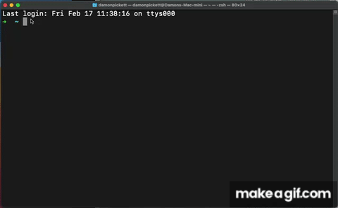

# MacTA
*Macintosh Terminal Assistant*

## Table of Contents
- [Project Title](#macta)
- [Description](#description)
- [Tech Stack](#tech-stack)
- [Installation](#installation)
- [Usage](#usage)
- [Contributing](#contributing)
- [License](#license)
- [Description](#description)
- [Installation](#installation)
- [Usage](#usage)
- [Contributing](#contributing)
- [License](#license)

## Description
MacTA is command-line application that utilizes the OpenAI API to generate instructions for performing tasks in the MacOS terminal. The purpose of this application is to generate clear and concise instructions without having to leave the terminal. This can be particularly helpful for individuals who are new to the terminal or unfamiliar with specific terminal commands.

After installation, upon the user's first attempt run MacTA, MacTA will prompt the user for their OpenAI API key. This will stored in a `config.json` file which will be saved in the MacTA directory within your global directory. The user will only have to enter their API key once.

This program is free to use. However, if you would like to <a href="https://www.buymeacoffee.com/damonpickett" target="_blank">buy me a coffee</a>, feel free!

  

## Tech Stack
This project utilizes several technologies, including:

* [**OpenAI API**](https://openai.com/api/): A cloud-based platform that allows users to build various artificial intelligence models, including natural language processing models that can generate text.
* [**readline**](https://nodejs.org/api/readline.html): A Node.js module that provides an interface for reading input from a user via the command line.
* [**fs**](https://nodejs.org/api/fs.html): A Node.js module that provides an interface for working with the file system.
* [**path**](https://nodejs.org/api/path.html): A Node.js module that provides utilities for working with file and directory paths.

In this project, the OpenAI API is used to generate text in response to user input. The readline module is used to read user input from the command line, while the fs module is used to read and write configuration data to a file. The path module is used to construct file paths for the configuration file.

## Installation
1. Install Node.js on your system. You can download Node.js from the official website: [Node.js](https://nodejs.org/)
2. Install MacTA globally by running the following command in your terminal: `npm install -g macta`
3. Obtain an API key for the OpenAI API from the [OpenAI website](https://beta.openai.com/signup/)
4. Run MacTA by entering the following command in your terminal: `macta`

You should now be prompted to enter a task description. MacTA will generate instructions based on your input. 

## Usage
1. Open your terminal and type `macta` from within any directory in your terminal.
2. You will be prompted to enter a description of the task you'd like to perform. For best results, simply answer the question “How do I…?” E.G. `delete a file`.
3. MacTA will generate a set of instructions based on your task description. The instructions will include a command-line example for the task, as well as any additional details that might be helpful.
4. If you'd like to perform another task, simply run the `macta` command again and repeat the process.

## Contributing
If you encounter a bug while using macta or would like to request a new feature, please submit an issue on the macta GitHub repository. To submit an issue, follow these steps:

1. Click the "Issues" tab at the top of the page.
2. Click the "New issue" button.
3. Fill out the template with as much detail as possible, including steps to reproduce the bug or a clear description of the new feature you're requesting.
4. Click the "Submit new issue" button.

Once you've submitted an issue, I will review it and respond as soon as possible.

## License
ISC